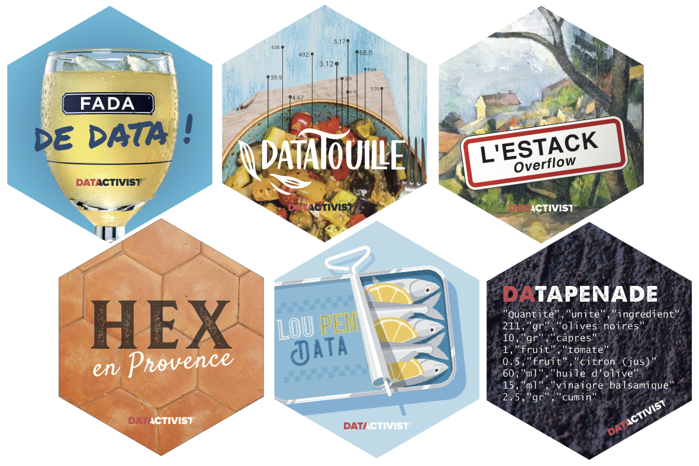
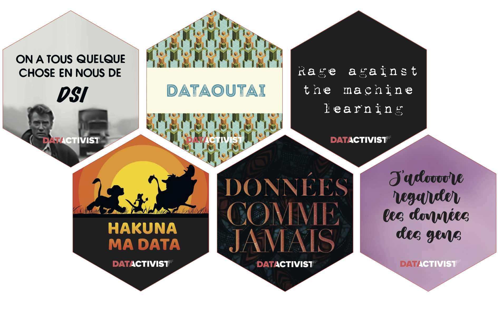

# Datactivist's stickers
### Saison 1

### Saison 2

### Saison 3

### Saison 4

Nous fournissons les [fichiers sources](https://www.dropbox.com/sh/bune0hozzqlqit4/AACuDB6JS-LSuQy9pH4ibIKia?dl=0e) de nos stickers sous licence CC-BY-SA/

Le graphisme a été réalisé par [Victor Peyre](https://fr.linkedin.com/in/victorpeyre), [Marie Spinato](https://maries-creations.com/) et l'agence [Parteja](https://parteja.net/) pour le compte de [Datactivist](http://www.datactivi.st).

